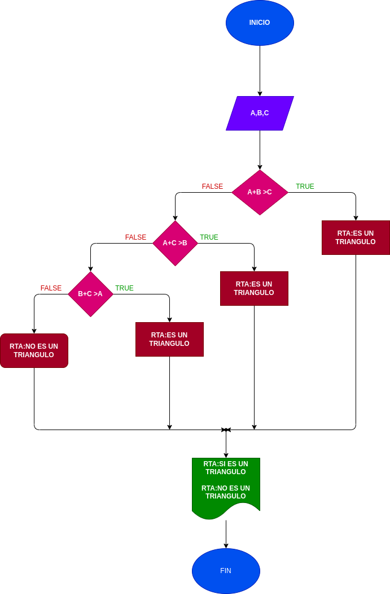

# Quiz instrucciones condicionales

### Realice el análisis, diseño y construcción para resolver el siguiente problema:

Dados tres números a, b y c, correspondientes a la longitud de los lados de una figura geométrica, determinar si pueden formar los lados de un triángulo.

# ANALISIS
variabes de entrada (input)
a:longitud lado a
b:longitud lado b
c:longitud lado c

variables de proceso (processing)
a+b>c
a+c>b
b+c>a
variables de salida (output)
print:dice si es un triangulo o no

# DISEÑO

